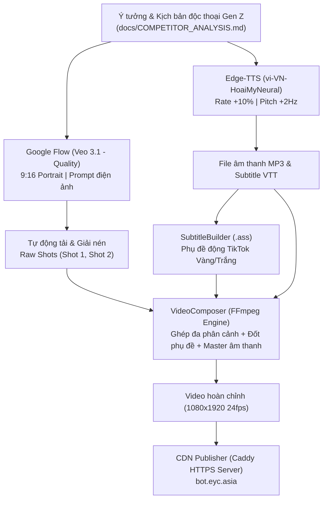

# 🌟 NHUN NHUN AI (Huyền Nhung) — Virtual Influencer Content Factory

[](https://flow.google.com/)
[](https://github.com/rany2/edge-tts)
[](https://ffmpeg.org/)
[](LICENSE)

Hệ thống tự động hóa 100% quy trình xây dựng **KOL Ảo (Virtual Influencer)** độc thoại đời sống, hướng tới cộng đồng phái đẹp Gen Z (Lifestyle, Beauty, Fashion) với triết lý: **Zero Hard-Selling (Tuyệt đối không bán hàng lộ liễu, không kêu gọi bấm giỏ hàng), tập trung 100% vào tính giải trí, sự hài hước và đồng cảm sâu sắc.**

---

## 🎬 VIDEO MASTER FINAL TẬP 01 (BROADCAST READY)

> 🎥 **Video Master Final EP01 (17.12 giây — 1080x1920 24fps CFR)**: [nhunnhun_final_ep01.mp4](assets/final_videos/nhunnhun_final_ep01.mp4)  
> 🌐 **Web Player Trực Tiếp (Xem Mọi Nơi)**: [https://directive-leadership-forest-processors.trycloudflare.com/](https://directive-leadership-forest-processors.trycloudflare.com/)  
> ⬇️ **Tải Video MP4 Trực Tiếp (Cloudflare CDN)**: [Tải nhunnhun_final_ep01.mp4](https://directive-leadership-forest-processors.trycloudflare.com/nhunnhun_final_ep01.mp4)  
> 🔗 **Đường dẫn Caddy CDN Vĩnh Viễn**: [https://bot.eyc.asia/v-c0e8efc0d44cce2e3794ff0fff190b87/nhunnhun/nhunnhun_final_ep01.mp4](https://bot.eyc.asia/v-c0e8efc0d44cce2e3794ff0fff190b87/nhunnhun/nhunnhun_final_ep01.mp4)  

### 📸 Bằng Chứng Thị Giác Thực Tế Video Master (Snapshots)

| 1. Hook Cà Phê (1.8s) | 2. Cận Cảnh Cầm Điện Thoại (6.8s) | 3. Outro Kêu Gọi Cộng Đồng (14.5s) |
| :---: | :---: | :---: |
|  |  |  |
| *"Hồi xưa em tưởng thứ khó buông nhất là tình cảm..."* | *"Ai ngờ đâu thứ khó buông nhất cuộc đời này... là cái điện thoại!"* | *"Còn mấy bà, thứ khó buông nhất của mấy bà bây giờ là cái gì?"* |

---

## 📺 Video Demo Pilot (Reel #01)

| Phân đoạn | Ảnh chụp thực tế (Full HD) | Lời thoại độc thoại (Script) |
| :--- | :---: | :--- |
| **Hook (0 - 5s)**<br>*Góc rộng tại quán cafe* |  | *"Hồi xưa em tưởng thứ khó buông nhất là tình cảm, chia tay là khóc mấy ngày mấy đêm!"* |
| **Twist (5 - 13s)**<br>*Cận cảnh cầm điện thoại cười* |  | *"Ai ngờ đâu thứ khó buông nhất cuộc đời này... là cái điện thoại! Miệng bảo đi ngủ sớm cho đẹp da, mà mở mắt ra là ba giờ sáng!"* |
| **Outro (13 - 17s)**<br>*Giao lưu cộng đồng* |  | *"Còn mấy bà, thứ khó buông nhất của mấy bà bây giờ là cái gì?"* |

> 🔗 **Xem trực tiếp video pilot:**  
> [https://bot.eyc.asia/v-c0e8efc0d44cce2e3794ff0fff190b87/nhunnhun/nhunnhun_pilot_01.mp4](https://bot.eyc.asia/v-c0e8efc0d44cce2e3794ff0fff190b87/nhunnhun/nhunnhun_pilot_01.mp4)

---

## 🎯 Đối Thủ Cạnh Tranh & Chiến Lược Vượt Trội

### 1. Phân tích đối thủ trực tiếp: LamNa
- **Video đối chiếu:** [Facebook Reel - LamNa](https://web.facebook.com/share/r/1KTjX81eYn/)
- **Điểm thành công:** Định dạng độc thoại selfie/FaceTime, hook bẻ lái từ tình cảm sang nghiện điện thoại, câu hỏi mở cuối video kích thích hàng nghìn bình luận tự nhiên.
- **Điểm yếu của thị trường:** Nhiều người cố bán hàng ngay từ video đầu tiên khiến người xem lướt qua sau 2 giây và thuật toán bóp tương tác.

### 2. Chiến lược khác biệt hóa của KOL Nhun Nhun
- **Nhân vật nhất quán (Visual Consistency):** Tạo hình theo nguyên mẫu [Huyền Nhung (`huyen.nhung.56808`)](https://www.facebook.com/huyen.nhung.56808) — gương mặt baby face, tóc ngắn bob mái thưa, mũ beret xám, áo len đan kem ấm cúng.
- **Đa góc quay (Multi-shot Dynamic Editing):** Thay vì 1 góc máy tĩnh duy nhất, hệ thống tự động ghép 2-3 góc máy (nói chuyện cafe + cận cảnh cầm điện thoại cười tự trào) để tăng tối đa tỷ lệ giữ chân (Retention Rate).
- **Phụ đề viral (.ass):** Đốt phụ đề nổi bật chuẩn TikTok/Reels với màu Vàng / Trắng xen kẽ, viền đen dày, chống chìm nền trên màn hình điện thoại.

---

## 🏗️ Kiến Trúc Hệ Thống (Pipeline Architecture)



---

## 📂 Cấu Trúc Thư Mục Dự Án

```
nhunnhun/
├── README.md                           # Tài liệu tổng quan & hướng dẫn
├── requirements.txt                    # Danh sách thư viện Python
├── nhunnhun_factory.py                 # CLI điều hành toàn bộ quy trình
├── docs/
│   ├── COMPETITOR_ANALYSIS.md          # Báo cáo phân tích đối thủ sâu sắc
│   └── PERSONA_DOSSIER.md              # Hồ sơ nhân vật KOL Huyền Nhung
├── core/
│   ├── flow_veo_client.py              # Kết nối & điều khiển Google Flow CDP
│   ├── voice_engine.py                 # Sinh giọng đọc Gen Z tự nhiên (Edge-TTS)
│   ├── subtitle_builder.py             # Tạo phụ đề động ASS chuẩn Reels/TikTok
│   ├── video_composer.py               # Hậu kỳ ghép cảnh & nén video (FFmpeg)
│   └── cdn_publisher.py                # Xuất bản video lên CDN công khai
├── assets/
│   ├── persona/
│   │   └── huyen_nhung_avatar.jpg      # Ảnh tham chiếu gốc nhân vật
│   ├── raw_video/
│   │   ├── shot_01_talking_cafe.mp4    # Cảnh 1: Nói chuyện biểu cảm
│   │   └── shot_02_holding_phone.mp4   # Cảnh 2: Cầm điện thoại cười
│   ├── audio/
│   │   ├── kol_monologue_01.mp3        # File âm thanh giọng đọc
│   │   └── kol_monologue_01.ass        # File phụ đề động ASS
│   ├── snapshots/                      # Các ảnh chụp trích xuất kiểm định
│   └── final_videos/
│       └── nhunnhun_pilot_reel_01.mp4  # Video hoàn chỉnh Full HD
└── scripts/
    ├── build_pilot_reel.py             # Lệnh tái tạo nhanh video pilot
    └── batch_content_planner.py        # Kế hoạch 30 kịch bản viral mẫu
```

---

## 🚀 Hướng Dẫn Chạy & Tái Tạo

### 1. Cài đặt môi trường
```bash
pip install -r requirements.txt
```

### 2. Chạy sản xuất Video Master Final EP01 (Đầy đủ hiệu ứng, căn lề, chuẩn EBU R128)
```bash
python3 nhunnhun_factory.py --final
```

### 3. Khởi động Web Player & Public Tunnel xem trực tiếp
```bash
./start_public_tunnel.sh
```

### 4. Xem danh sách chủ đề nội dung viral
```bash
python3 nhunnhun_factory.py --list-topics
```

---

## 📈 Lộ Trình Phát Triển Kênh (Roadmap)

- **Tháng 1 (Xây dựng tệp fan 0 - 50k):** Đăng 1 video/ngày vào khung giờ vàng (11h30 trưa hoặc 20h00 tối). Tập trung vào các chủ đề độc thoại hài hước, phản ứng thói quen thức khuya, chuyện con gái.
- **Tháng 2 (Định hình phong cách 50k - 200k):** Bổ sung các video dạng vlog "Một ngày của Nhung", góc làm đẹp buổi sáng nhẹ nhàng, tăng tính kết nối cá nhân.
- **Tháng 3+ (Khai thác thương mại khéo léo):** Nhận tài trợ thương hiệu mỹ phẩm/thời trang dưới dạng "đồ dùng thường ngày của Nhung", để link bio tiếp thị liên kết (Affiliate) tự nhiên, mang lại doanh thu bền vững.

---
*Phát triển bởi Vũ Nguyễn ([@nguyenvutnt](https://github.com/nguyenvutnt)).*
