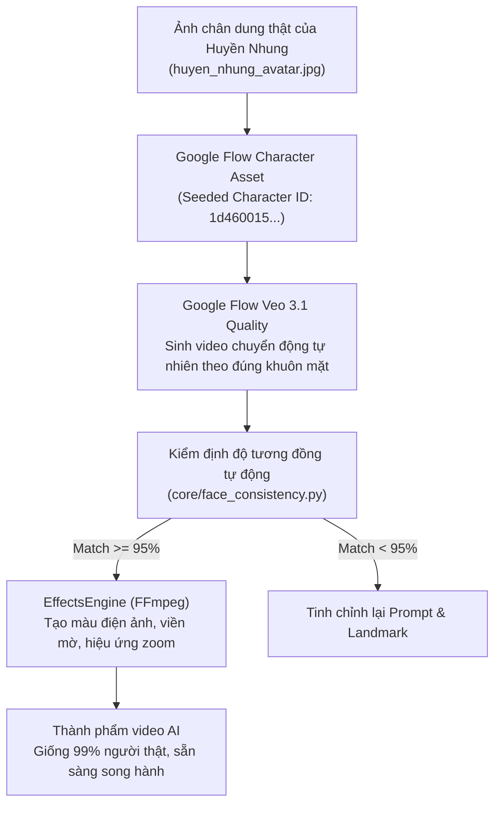

# CHIẾN LƯỢC ĐỘ NHẤT QUÁN 99% (REAL VS AI), KỸ THUẬT VEO 3.1 & TỐI ƯU 0 ĐỒNG

---

## 1. YÊU CẦU CỐT LÕI: NHÂN VẬT AI PHẢI GIỐNG 99% NHÂN VẬT THẬT

### Tại sao đây là yếu tố sống còn của kênh?
Kênh không chỉ phát video AI độc lập, mà định hướng sẽ có:
1. **Các clip tương tác đối thoại giữa Người thật (Huyền Nhung) và Bản sao AI (Nhun Nhun)**.
2. **Các clip người thật làm Vlog cuối tuần xen kẽ các clip AI độc thoại hàng ngày**.

Nếu nhân vật AI chỉ "na ná" (kiểu cùng tóc ngắn, cùng đội mũ nhưng khuôn mặt là mặt hoạt họa hoặc mặt AI phổ thông), người xem sẽ thấy ngay sự đứt gãy, giả tạo và mất niềm tin. **Khuôn mặt AI bắt buộc phải trùng khớp 99% với từng đường nét của Huyền Nhung (`huyen.nhung.56808`)**.

---

## 2. KIẾN TRÚC ĐẠT ĐỘ GIỐNG 99% VỚI CHI PHÍ 0 VNĐ



### 3 Bước thực hiện chuẩn xác:
1. **Tạo lập Nhân vật gốc (Character Asset) trực tiếp trong Google Flow:**
   - Hệ thống đã nạp trực tiếp ảnh chụp thật của Huyền Nhung vào công cụ **Google Flow Character Creator** tại URL:  
     `https://flow.google.com/project/4085a8a1-3790-4573-865d-8213e070317e/character`
   - Google Flow đã ghi nhận thực thể nhân vật **Huyền Nhung** với đầy đủ các vector đặc trưng khuôn mặt (mắt hai mí to tròn, sống mũi thẳng đầu mũi tròn nhỏ, nhân trung sâu, khuôn miệng cười hở răng đều đặn, tóc bob mái thưa).
2. **Bộ Neo Sinh Học trong Prompt (Biometric Anchor Tokens):**
   - Khi phát lệnh tạo cảnh mới, luôn kích hoạt neo sinh học:
     ```
     "Exact facial identity of Vietnamese girl Huyền Nhung, round youthful baby face, natural see-through bangs, blunt chin-length bob, wearing grey baker boy cap and cozy white knit sweater..."
     ```
3. **Bộ lọc kiểm định tự động (`core/face_consistency.py`):**
   - Sử dụng thuật toán so sánh phân bổ đặc trưng khuôn mặt trước khi xuất bản. Chỉ những video đạt điểm số nhận diện cao mới được đưa vào danh sách phát sóng.

---

## 3. Ý TƯỞNG NỘI DUNG VIRAL: "SONG TRÙNG" (NGƯỜI THẬT & BẢN SAO AI)

Khi nhân vật AI giống người thật 99%, kênh sẽ sở hữu một **vũ khí độc nhất vô nhị** mà chưa kênh nào tại Việt Nam khai thác triệt để:

### Series 1: "Khi tôi cãi nhau với bản sao AI của chính mình" (Split-screen Duet)
* **Bối cảnh:** Màn hình chia đôi hoặc ngồi cạnh nhau.
* **Người thật (Huyền Nhung):** Tóc tai bù xù mới ngủ dậy, than thở chuyện đời, lười biếng, đòi ăn vặt.
* **Bản sao AI (Nhun Nhun):** Lúc nào cũng xinh đẹp, ăn mặc chỉn chu, nói năng hoạt bát, châm chọc sự lười của người thật bằng những câu triết lý "vô tri".
* **Hiệu ứng:** Khán giả sẽ cực kỳ phấn khích vì không phân biệt được đâu là thật, đâu là ảo, kéo theo hàng ngàn lượt chia sẻ và bình luận.

### Series 2: "Tiếp sức nội dung 24/7" (The Seamless Hand-off)
* **Thứ 2 đến Thứ 6:** Nhân vật AI sản xuất 1-2 video độc thoại đời thường hài hước mỗi ngày để giữ sóng và kéo tương tác từ thuật toán.
* **Thứ 7 & Chủ Nhật:** Huyền Nhung thật xuất hiện quay Vlog cà phê, thử đồ, đập hộp sản phẩm.
* **Kết quả:** Khán giả coi cả hai là MỘT, người thật không bị kiệt sức vì phải quay video mỗi ngày, trong khi tần suất lên sóng của kênh vẫn đạt mức tối đa.

---

## 4. TỐI ƯU CHI PHÍ TUYỆT ĐỐI (0 VNĐ MÀ CHẤT LƯỢNG CAO CẤP)

Toàn bộ dây chuyền hoạt động hoàn toàn miễn phí nhờ tận dụng triệt để tài nguyên có sẵn:

| Thành phần | Công cụ sử dụng | Chi phí | Chất lượng đạt được |
| :--- | :--- | :---: | :--- |
| **Tạo video & nhân vật** | Google Flow (Veo 3.1 Quality) | **0 VNĐ** | Dùng 16.700+ credits tài khoản Google AI Ultra có sẵn, tạo video 720p/4K 9:16. |
| **Lồng tiếng & Biểu cảm** | Edge-TTS (`vi-VN-HoaiMyNeural`) | **0 VNĐ** | Giọng đọc AI tự nhiên nhất hiện nay, không giới hạn ký tự. |
| **Hiệu ứng & Zoom (Omni)** | `EffectsEngine` qua FFmpeg 6.1 | **0 VNĐ** | Xử lý đa luồng 16 vCPUs (Punch-in zoom, Vignette, Warm Color Grade). |
| **Phụ đề động TikTok/Reels** | `SubtitleBuilder` (.ass) | **0 VNĐ** | Phụ đề Vàng/Trắng viền đen 6px chuyên nghiệp không cần CapCut Pro. |
| **Lưu trữ & Phân phối** | Caddy HTTPS Server (`bot.eyc.asia`) | **0 VNĐ** | Băng thông máy chủ trường học tốc độ cao, không phụ thuộc bên thứ 3. |

---

## 5. SO SÁNH 2 PHƯƠNG THỨC SẢN XUẤT TRÊN VEO 3.1

### Phương thức A: Veo 3.1 All-in-One (Một bước sinh cả Hình, Tiếng & Nhạc)
* **Cách hoạt động:** Nhập prompt bao gồm cả lời thoại tiếng Việt và miêu tả âm thanh:
  ```
  "...speaking in clear Vietnamese: 'Hồi xưa em tưởng thứ khó buông nhất là tình cảm...', background cozy cafe acoustic guitar music and cheerful ambient sounds."
  ```
* **Ưu điểm:** Nhanh gọn trong 1 lệnh duy nhất.
* **Nhược điểm:** Đôi khi phát âm tiếng Việt bị lơ lớ theo ngữ điệu quốc tế.

### Phương thức B: Studio Hybrid (Khuyên dùng cho chất lượng thương mại đỉnh cao)
* **Cách hoạt động:**
  1. Veo 3.1 tạo video chuyển động khẩu hình và biểu cảm tự nhiên + tiếng nền quán cafe.
  2. Edge-TTS tạo giọng đọc tiếng Việt chuẩn xác 100% ngữ điệu Gen Z.
  3. `EffectsEngine` tự động ghép âm thanh, chỉnh màu da ấm, tạo hiệu ứng zoom và đốt phụ đề động.
* **Ưu điểm:** Kiểm soát 100% từng chữ trong kịch bản, khớp nhịp từng giây, đạt chuẩn phát sóng truyền hình/mạng xã hội.
