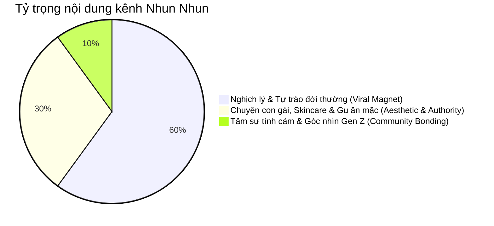
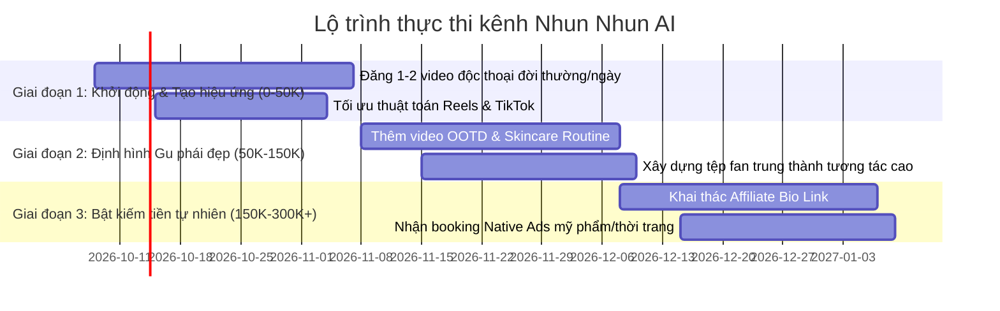

# CHIẾN LƯỢC TOÀN DIỆN: GIẢI MÃ ĐỐI THỦ LAMNA & KẾ HOẠCH THỰC THI KÊNH NHUN NHUN

---

## PHẦN 1: BÁO CÁO GIẢI MÃ TOÀN BỘ KÊNH ĐỐI THỦ (LAMNA - @LAMNATV)

### 1. Bức tranh số liệu thực tế (Evidence-backed Metrics)
- **Tên trang:** LamNa (`facebook.com/LamNatv`)
- **Quy mô:** **223.398 người theo dõi**
- **Chỉ số tương tác hiện thời:** **168.236 người đang nói về điều này** (Tỷ lệ tương tác hoạt động đạt xấp xỉ **75%** — mức kỷ lục trên Facebook Reels Việt Nam).
- **Phân loại nhận diện:** Được Meta dán nhãn chính thức: **`AI content`**.
- **Hiệu suất lượt xem tiêu biểu trên Reels:**
  - *Út Lan 2 Ngoại truyện Parody (Ma da):* **4.400.000 views** (72.5K reactions, 876 comments, 1.4K shares).
  - *Chú mua đồ điện hả (Chỉ đường có tâm):* **1.600.000 views** (20.8K reactions, 492 comments, 272 shares).
  - *Hà Bá sợ LamNa:* **1.100.000 views** (15.9K reactions, 234 comments, 119 shares).
  - *Thứ khó buông bỏ nhất (Điện thoại):* **1.000.000+ views** (5.1K reactions, 141 comments, 103 shares).

---

### 2. Bản chất công thức thành công của LamNa
LamNa không dùng nhan sắc mỹ nữ người thật, mà tạo ra một **"Hệ tư tưởng vô tri"** gây nghiện nhờ 4 yếu tố cốt lõi:

1. **Nhân vật "Nhiệt tình nhưng ngây ngô" (The Lovable Goofball):**
   - Không tỏ ra thông minh hay dạy dỗ ai.
   - Thể hiện sự hồn nhiên, lanh chanh, thích giúp đỡ nhưng toàn gây họa (ví dụ: thấy người mua đồ điện cũ tưởng họ không biết chỗ mua mới nên chỉ ra siêu thị; hỏi bác sĩ những câu phi lý khiến ma quỷ cũng sợ).
2. **Hook đánh trúng tâm lý trong 2 giây đầu:**
   - Đặt vấn đề bằng tình huống kịch tính hoặc câu hỏi gây tò mò: *"Sao dì Út bả khai trương có 2 ngày mà đòi đóng cửa luôn vậy?", "Gặp chú rao mua tivi máy giặt, em tưởng chú hổng biết chỗ mua..."*
3. **Giọng đọc & Ngôn ngữ địa phương dân dã:**
   - Sử dụng giọng Nam/Tây Nam Bộ dí dỏm, ngữ điệu nhấn nhá tự nhiên, từ ngữ thông dụng: *"mấy bà", "con báo", "hà bá", "má ơi", "gánh còng lưng"*.
4. **Kỹ thuật kéo Comment "vô đối":**
   - Kết thúc không bao giờ là kết luận, mà luôn là câu hỏi chia phe: *"Theo mọi người nên đuổi đứa nào trước? Đứa làm đổ hay đứa té?", "Còn mọi người, thứ khó buông nhất là gì?"*
   - Khán giả bình luận hàng trăm ý kiến tạo dòng chảy thảo luận liên tục, giúp thuật toán Meta phân phối video ra toàn bộ News Feed.

---

### 3. Mô hình dòng tiền của LamNa (Monetization Architecture)
LamNa **hoàn toàn không làm clip bán hàng theo kiểu giỏ hàng truyền thống**, mà khai thác dòng tiền thông minh qua 3 kênh:
- **Doanh thu hiển thị (Ads on Reels / Meta Bonus):** Với hàng chục triệu view mỗi tháng, doanh thu lượt xem từ Meta đem lại nguồn thu thụ động ổn định.
- **Tài trợ địa điểm & F&B bản địa (Local Native Sponsorship):** 
  - *Bằng chứng:* Trong video khai trương quán ăn, LamNa ghim bình luận: *"Ai ở Q10 ghé 395/12 Hòa Hảo cứu dì Út với, tội dì quá!"*. Đây là hình thức booking quảng cáo quán ăn tinh vi, không làm khán giả khó chịu mà lại có tỷ lệ chuyển đổi khách ghé quán cực kỳ cao.
- **Booking nhãn hàng dạng tiểu phẩm hài (Custom Branded Sketches):** Các nhãn hàng tiêu dùng nhanh (FMCG), ứng dụng công nghệ book LamNa đóng tiểu phẩm tình huống có lồng ghép logo/dịch vụ khéo léo.

---

### 4. Điểm yếu của LamNa & Lỗ hổng thị trường để ta đánh chiếm

| Tiêu chí | Điểm yếu của LamNa | Cơ hội vượt bậc của Nhun Nhun |
| :--- | :--- | :--- |
| **Hình thái nhân vật (Visual)** | Tạo hình 3D hoạt hình hoạt họa, tính chân thực thấp, khó đại diện cho ngành làm đẹp/thời trang cao cấp. | **Veo 3.1 Photorealistic 4K:** Gương mặt thật chuẩn hot girl Gen Z, làn da mịn màng, gu thời trang áo len mũ beret aesthetic chuẩn Hàn Quốc. |
| **Tệp khán giả mục tiêu** | Hài nhảm đại chúng (mọi lứa tuổi, nhiều nam giới xem giải trí đơn thuần). | **Phái đẹp Gen Z (18 - 30 tuổi):** Tệp khán giả có sức mua mỹ phẩm, thời trang, skincare và dịch vụ làm đẹp cao nhất mạng xã hội. |
| **Giá trị thương mại (Brand Value)** | Khó nhận hợp đồng từ các hãng mỹ phẩm, skincare cao cấp vì phong cách quá hài nhảm. | **Dễ dàng nhận booking từ Skincare, Mỹ phẩm, OOTD, Thẩm mỹ viện, Quán cafe:** Vì nhân vật vừa hài hước, vừa có gu thẩm mỹ cao và làn da đẹp. |

---

## PHẦN 2: CHIẾN LƯỢC TOÀN DIỆN KÊNH NHUN NHUN

### 1. Định vị thương hiệu (Brand Positioning)
- **Danh xưng:** **Nhun Nhun (Huyền Nhung)**
- **Định vị cốt lõi:** *"Cô bạn gái quốc dân Gen Z — Mặt thiên thần, tính lầy lội, chuyên gia nghịch lý đời thường."*
- **Slogan ngầm:** Đến vì visual xinh xắn, ở lại vì sự duyên dáng vô tri, mua hàng vì tin tưởng tuyệt đối vào gu của Nhung.

---

### 2. Ma trận nội dung 3 tầng (The 3-Tier Content Engine)

1. **Tầng 1: Nam châm Viral (60% - Top of Funnel)**
   - *Mục tiêu:* Hút view, kéo follow, tạo tương tác triệu view giống LamNa.
   - *Chủ đề:* Thức khuya lướt điện thoại, thề giảm cân nhưng ăn đêm, nỗi sợ thứ Hai, hội chứng ngủ nướng 5 phút, sự khác biệt giữa kỳ vọng và thực tế.
   - *Nguyên tắc:* 100% không nhắc đến sản phẩm.
2. **Tầng 2: Định hình Phong cách & Uy tín làm đẹp (30% - Middle of Funnel)**
   - *Mục tiêu:* Xây dựng nhận thức về một cô gái biết chăm sóc bản thân, da đẹp, dáng xinh, mặc đẹp.
   - *Chủ đề:* Bí kíp kẻ eyeliner không lệch, cứu cánh làn da sau đêm thức khuya, chọn màu son cho da ngăm, phối đồ mùa đông với mũ beret và áo len.
3. **Tầng 3: Khai thác giá trị thương mại tự nhiên (10% - Bottom of Funnel / Native Selling)**
   - *Mục tiêu:* Chuyển đổi ra doanh thu mà không mất chất KOL.
   - *Hình thức:*
     - Lồng ghép tự nhiên vào bối cảnh (Ví dụ: Nhung đang nói chuyện về chuyện đi làm muộn thì tiện tay thoa nhẹ cây son dưỡng trên bàn).
     - Ghim comment chia sẻ mã giảm giá hoặc link bio: *"Mấy bà hỏi áo len với son của Nhung nhiều quá, Nhung để link ở phần giới thiệu trang nha!"*.

---

## PHẦN 3: KẾ HOẠCH THỰC THI (ACTION ROADMAP)

### Lộ trình 90 ngày chinh phục 300.000 Người theo dõi

---

## PHẦN 4: QUY TRÌNH VẬN HÀNH NHÀ MÁY NỘI DUNG TỰ ĐỘNG (SOP)

Mỗi ngày chỉ mất **15 phút chạy máy ảo** để xuất bản 1-2 video chất lượng điện ảnh:

1. **Bước 1: Chọn kịch bản từ Kho chủ đề (`batch_content_planner.py`)**
   - Kịch bản dài từ 40 - 65 từ (tương đương 14 - 18 giây).
   - Đảm bảo có đủ 3 phần: Hook bẻ lái (0-3s) ➜ Thân đoạn tự trào (3-12s) ➜ Câu hỏi mở kích thích bình luận (12-16s).
2. **Bước 2: Sinh hình ảnh sống động qua Google Flow (Veo 3.1 Quality 9:16)**
   - Chạy 2 shot:
     - Shot 1: Góc trung (Medium shot) ngồi quán cafe nói chuyện, nghiêng đầu duyên dáng.
     - Shot 2: Cận cảnh (Close-up) cầm điện thoại cười tít mắt hoặc biểu cảm ngạc nhiên.
3. **Bước 3: Thu âm giọng nói truyền cảm với Edge-TTS**
   - Lệnh tự động: `VoiceEngine(voice="vi-VN-HoaiMyNeural", rate="+10%", pitch="+2Hz")`.
4. **Bước 4: Tạo phụ đề động ASS chuẩn viral**
   - Font chữ lớn, màu Vàng / Trắng xen kẽ, viền đen dày 6px, bóng đổ sâu 3px, căn chỉnh cách đáy 380px an toàn tuyệt đối cho thanh điều hướng TikTok/Reels.
5. **Bước 5: Ghép đa cảnh & Xuất bản CDN qua FFmpeg**
   - Lệnh tự động dựng: `python3 nhunnhun_factory.py --pilot`.
   - File nén Full HD 1080x1920 24fps được tải thẳng lên `bot.eyc.asia` để phân phối đa nền tảng.
